# Transaction state machine

Implemented in `web/src/lib/stateMachine.ts`; every transition is validated (`canTransition`),
illegal moves throw, and the table is unit-tested in `stateMachine.test.ts`.

```mermaid
stateDiagram-v2
    [*] --> offer_accepted : Seller accepts a sealed offer (binding)
    offer_accepted --> payment_authorised : Buyer authorises funds (escrow pre-auth)
    offer_accepted --> cancelled : Buyer fails to fund / mutual cancellation
    payment_authorised --> awaiting_shipment : Platform issues insured shipping instructions
    payment_authorised --> cancelled
    awaiting_shipment --> in_transit_to_authentication : Seller lodges insured shipment
    awaiting_shipment --> cancelled : Seller withdrawal (fee consequences)
    in_transit_to_authentication --> received_at_authentication : Arrival + packaging check
    in_transit_to_authentication --> disputed : Lost / damaged shipment
    received_at_authentication --> inspection_in_progress : Watchmaker begins 20-section inspection
    inspection_in_progress --> inspection_complete : Report issued
    inspection_complete --> settlement : Passed as described (automatic)
    inspection_complete --> buyer_review : Passed with minor discrepancy
    inspection_complete --> resolution : Material discrepancy / inconclusive / manufacturer review
    inspection_complete --> disputed : Failed / suspected stolen or altered
    buyer_review --> settlement : Buyer proceeds at accepted price
    buyer_review --> resolution : Buyer proposes amended offer
    buyer_review --> cancelled : Buyer cancels under platform rules
    resolution --> settlement : Parties agree (e.g. seller accepts amended amount)
    resolution --> cancelled
    resolution --> disputed
    disputed --> resolution
    disputed --> settlement
    disputed --> cancelled
    settlement --> in_transit_to_buyer : Funds released; watch dispatched insured
    in_transit_to_buyer --> completed : Buyer confirms delivery
    in_transit_to_buyer --> disputed : Shipping damage / loss
    completed --> [*]
    cancelled --> [*]
```

## Rules encoded alongside the graph

- **Entry**: a transaction exists only after `acceptOffer` — which also requires the seller's
  KYC to be `verified` and marks all competing offers `lost`.
- **Inspection outcome mapping** (`stateAfterInspection`):
  `passed_as_described → settlement`, `passed_minor_discrepancy → buyer_review`,
  `passed_material_discrepancy | inconclusive | requires_manufacturer_review → resolution`,
  `failed | suspected_stolen_or_altered → disputed` (a dispute case is opened automatically).
- **Terminal states**: `completed`, `cancelled` — no exits.
- **Settlement is one-way**: once conditions are satisfied and funds release, the only path is
  delivery → completion (a delivery problem raises a dispute, it does not unwind settlement).
- Every transition appends to the transaction timeline, the audit log, and (where custody is
  affected) the chain-of-custody record.

## Per-state UI contract

For each state the UI surfaces three fixed questions (see `STATE_GUIDANCE`):
**what happens next**, **who is responsible**, and **what is binding** — satisfying the
transparency principle at every stage.
